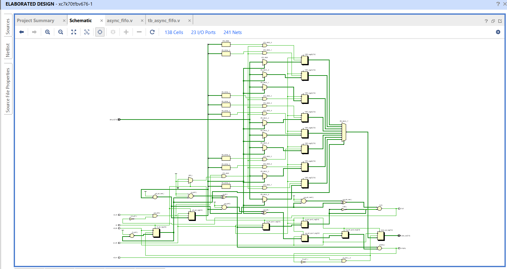
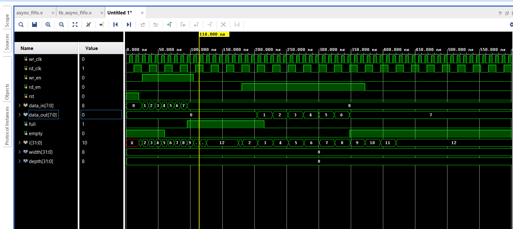

# Asynchronous FIFO (Dual-Clock FIFO) in Verilog

A parameterized Asynchronous FIFO implementation in Verilog, designed for reliable data transfer between two independent clock domains. This design uses the industry-standard Gray-code pointer synchronization technique to safely handle Clock Domain Crossing (CDC) and avoid metastability.

## Table of Contents

- [Repository Structure](#repository-structure)
- [Overview](#overview)
- [Why Not a Normal (Synchronous) FIFO?](#why-not-a-normal-synchronous-fifo)
- [Key Concepts](#key-concepts)
- [Module: async_fifo](#module-async_fifo)
- [Signal Descriptions](#signal-descriptions)
- [Line-by-Line Explanation of Key Logic](#line-by-line-explanation-of-key-logic)
- [Full and Empty Flag Derivation (In Depth)](#full-and-empty-flag-derivation-in-depth)
- [Testbench: tb_async_fifo](#testbench-tb_async_fifo)
- [Schematic](#schematic)
- [Simulation Waveform](#simulation-waveform)
- [How to Simulate (Xilinx Vivado)](#how-to-simulate-xilinx-vivado)
- [Notes and Possible Improvements](#notes-and-possible-improvements)
- [Tools Used](#tools-used)
- [License](#license)

## Repository Structure

| File | Description |
|---|---|
| `async_fifo.v` | RTL design of the asynchronous FIFO |
| `tb_async_fifo.v` | Testbench for simulation |
| `schematic.png` | Block-level schematic of the design |
| `waveform.png` | Simulation waveform output |

## Overview

A FIFO (First-In-First-Out) buffer is used to transfer data between two clock domains that are not synchronized to each other, for example between a fast processor and a slower peripheral. Since the write and read operations occur in different clock domains, directly comparing pointers across domains can lead to **metastability** and **data corruption**.

This design solves that problem by:

- Using binary pointers internally for memory addressing
- Converting pointers to Gray code before crossing clock domains
- Passing Gray-coded pointers through a 2-stage synchronizer (double flip-flop) in the destination clock domain
- Generating accurate `full` and `empty` flags based on the synchronized pointers

## Why Not a Normal (Synchronous) FIFO?

In a synchronous FIFO, both read and write logic share a single clock, so pointer comparisons (`full`/`empty`) are always valid at the same instant. In an **asynchronous FIFO**, the write and read clocks are independent and may not even have a fixed phase relationship. If a multi-bit binary pointer were sampled directly by a flip-flop in the other clock domain, multiple bits could change at once (e.g. `011` → `100`), and different bits might get sampled at different times. This can cause the synchronized value to briefly become an invalid, in-between number, corrupting the `full`/`empty` decision. This is why binary pointers are never passed directly between domains in this design.

## Key Concepts

**Metastability**
When a signal changes very close to a flip-flop's clock edge in a different, unrelated clock domain, the flip-flop's output can go into an unpredictable, unstable state for a short time before settling to `0` or `1`. This is called metastability, and if left unresolved it can propagate invalid data through the design.

**Double Flip-Flop Synchronizer**
The standard fix for metastability is to pass the signal through two flip-flops in series in the destination clock domain. The first flip-flop may go metastable, but it is given a full clock cycle to resolve before the second flip-flop samples it. This does not fix multi-bit bus issues by itself, which is why Gray code is also needed.

**Gray Code**
Gray code is a binary numbering system where only one bit changes between any two consecutive values (e.g. `000 → 001 → 011 → 010`). Because only a single bit toggles at a time, even if the synchronizer samples the pointer mid-transition, the result is guaranteed to be either the old value or the new value, never an invalid one. This makes Gray code the safe choice for multi-bit values crossing clock domains.

**Extra Pointer Bit (MSB) for Full Detection**
Both `wb_ptr` and `rb_ptr` are declared as `[addr_width:0]`, one bit wider than needed to address the memory (`addr_width = $clog2(depth)`). This extra MSB is used purely to distinguish the "FIFO full" case from the "FIFO empty" case. Without it, a full FIFO and an empty FIFO would have identical pointer values (since the pointer wraps around), and the two conditions could not be told apart.

## Module: async_fifo

### Parameters

| Parameter | Description | Default |
|---|---|---|
| `width` | Data width (bits) | 8 |
| `depth` | FIFO depth (number of entries) | 8 |

### Signal Descriptions

| Port / Signal | Direction | Width | Description |
|---|---|---|---|
| `wr_clk` | Input | 1 | Write clock |
| `rd_clk` | Input | 1 | Read clock |
| `wr_en` | Input | 1 | Write enable |
| `rd_en` | Input | 1 | Read enable |
| `rst` | Input | 1 | Asynchronous reset (active high) |
| `data_in` | Input | width | Data to be written into the FIFO |
| `data_out` | Output | width | Data read from the FIFO |
| `full` | Output | 1 | High when FIFO is full |
| `empty` | Output | 1 | High when FIFO is empty |
| `FIFO` | Internal memory | depth x width | The actual storage array |
| `wb_ptr` / `rb_ptr` | Internal | addr_width+1 | Binary write / read pointers |
| `wg_ptr` / `rg_ptr` | Internal | addr_width+1 | Gray-coded write / read pointers |
| `wg_ptr_sync1/2` | Internal | addr_width+1 | Write pointer synchronized into read clock domain |
| `rg_ptr_sync1/2` | Internal | addr_width+1 | Read pointer synchronized into write clock domain |

## Line-by-Line Explanation of Key Logic

### Write Logic

```verilog
always @(posedge wr_clk or posedge rst) begin
    if (rst)
        wb_ptr <= 0;
    else if (wr_en && !full) begin
        FIFO[wb_ptr[addr_width-1:0]] <= data_in;
        wb_ptr <= wb_ptr + 1;
    end
end
```

- Runs on every rising edge of `wr_clk`, or immediately on `rst`.
- On reset, the write pointer is cleared to `0`.
- If `wr_en` is asserted and the FIFO is **not** full, `data_in` is written into the memory location addressed by the lower `addr_width` bits of `wb_ptr`, and the pointer is incremented.
- The MSB of `wb_ptr` is intentionally excluded from the memory address (`wb_ptr[addr_width-1:0]`) since it exists only for full/empty detection, not addressing.

### Write Pointer to Gray Code

```verilog
assign wg_ptr = (wb_ptr >> 1) ^ wb_ptr;
```

- This is the standard binary-to-Gray conversion: each Gray bit is the XOR of a binary bit with the binary bit one position higher.
- Converts the binary write pointer into Gray code so it can be safely sent across to the read clock domain.

### Read Logic

```verilog
always @(posedge rd_clk or posedge rst) begin
    if (rst) begin
        rb_ptr <= 0;
        data_out <= 0;
    end
    else if (rd_en && !empty) begin
        data_out <= FIFO[rb_ptr[addr_width-1:0]];
        rb_ptr <= rb_ptr + 1;
    end
end
```

- Runs on every rising edge of `rd_clk`, or immediately on `rst`.
- On reset, the read pointer and `data_out` are cleared.
- If `rd_en` is asserted and the FIFO is **not** empty, the memory location addressed by the lower `addr_width` bits of `rb_ptr` is read into `data_out`, and the pointer is incremented.

### Read Pointer to Gray Code

```verilog
assign rg_ptr = (rb_ptr >> 1) ^ rb_ptr;
```

- Same binary-to-Gray conversion as the write side, applied to the read pointer so it can be safely sent into the write clock domain.

### Synchronizing the Write Pointer into the Read Clock Domain

```verilog
always @(posedge rd_clk or posedge rst) begin
    if (rst) begin
        wg_ptr_sync1 <= 0;
        wg_ptr_sync2 <= 0;
    end
    else begin
        wg_ptr_sync1 <= wg_ptr;
        wg_ptr_sync2 <= wg_ptr_sync1;
    end
end
```

- A two-flip-flop chain, clocked by `rd_clk`, that samples the Gray-coded write pointer.
- `wg_ptr_sync1` may briefly go metastable if `wg_ptr` changes close to the `rd_clk` edge; `wg_ptr_sync2` samples the already-settled value one cycle later.
- `wg_ptr_sync2` is the value actually used to compute `empty` in the read domain.

### Synchronizing the Read Pointer into the Write Clock Domain

```verilog
always @(posedge wr_clk or posedge rst) begin
    if (rst) begin
        rg_ptr_sync1 <= 0;
        rg_ptr_sync2 <= 0;
    end
    else begin
        rg_ptr_sync1 <= rg_ptr;
        rg_ptr_sync2 <= rg_ptr_sync1;
    end
end
```

- The same double-flip-flop synchronizer pattern, but in the opposite direction: it brings the Gray-coded read pointer safely into the write clock domain.
- `rg_ptr_sync2` is the value used to compute `full` in the write domain.

## Full and Empty Flag Derivation (In Depth)

### Empty Flag

```verilog
assign empty = (rg_ptr == wg_ptr_sync2);
```

- The FIFO is empty when the read pointer has "caught up" to the write pointer, i.e. every written entry has already been read.
- This comparison is done entirely in the read clock domain, using the local `rg_ptr` and the synchronized copy of the write pointer, `wg_ptr_sync2`.
- Comparing Gray-coded values here (instead of binary) is what makes this comparison safe even though `wg_ptr_sync2` originated in a different clock domain.

### Full Flag

```verilog
assign wb_ptr_next = wb_ptr + 1;
assign wg_ptr_next = (wb_ptr_next >> 1) ^ wb_ptr_next;
assign full = (wg_ptr_next == {~rg_ptr_sync2[addr_width:addr_width-1], rg_ptr_sync2[addr_width-2:0]});
```

- `wb_ptr_next` is what the binary write pointer *would* become after the next write. It is computed one cycle ahead so that `full` is available in time to block the write that would cause an overflow.
- `wg_ptr_next` converts that look-ahead pointer into Gray code, using the same binary-to-Gray formula as before.
- The FIFO is full when the *next* write-pointer Gray value would equal the synchronized read pointer, but with its **top two bits inverted**. Inverting the top two MSBs of a Gray-coded pointer is the standard trick to detect a full "wrap-around" condition, since in Gray code the wrapped write pointer differs from the read pointer only in those two MSBs when the FIFO is genuinely full.
- This comparison is done entirely in the write clock domain, using the local (look-ahead) write pointer and the synchronized copy of the read pointer, `rg_ptr_sync2`.

## Testbench: tb_async_fifo

The testbench verifies the FIFO by:

1. Driving two independent, asynchronous clocks: `wr_clk` at a 10 ns period (100 MHz) and `rd_clk` at a 24 ns period (about 41.6 MHz).
2. Applying an asynchronous reset at the start of simulation.
3. Write phase: writing 11 sequential values (1 to 11) into the FIFO, checking the `full` flag before every write.
4. Read phase: reading back 11 values from the FIFO, checking the `empty` flag before every read.
5. Logging all read/write transactions with `$display` for correlation against the waveform.

Sample console output:

```
---- Writing Data ----
20 ns : WRITE data_in = 1 (full = 0)
30 ns : WRITE data_in = 2 (full = 0)
---- Reading Data ----
120 ns : READ data_out = 1 (empty = 0)
144 ns : READ data_out = 2 (empty = 0)
```

## Schematic

The block-level architecture of the design, showing the write/read logic, Gray code converters, and dual flip-flop synchronizers:



## Simulation Waveform

Example simulation waveform showing write and read operations across the two asynchronous clock domains:



## How to Simulate (Xilinx Vivado)

1. Open Vivado and create a new RTL project.
2. Add `async_fifo.v` as a design source.
3. Add `tb_async_fifo.v` as a simulation source.
4. Set `tb_async_fifo` as the top module under Simulation Sources.
5. Run behavioral simulation:
   - Flow Navigator -> Simulation -> Run Simulation -> Run Behavioral Simulation
6. View the waveform in the Vivado Waveform Viewer, and check the Tcl console for the `$display` log output.

### Using Vivado in Tcl/batch mode (optional)

```tcl
create_project fifo_sim ./fifo_sim -part xc7a35tcpg236-1 -force
add_files -norecurse async_fifo.v
add_files -fileset sim_1 -norecurse tb_async_fifo.v
set_property top tb_async_fifo [get_filesets sim_1]
launch_simulation
run all
```

## Notes and Possible Improvements

- Add `$dumpfile` / `$dumpvars` in the testbench to auto-generate a `.vcd` waveform file.
- Add almost-full / almost-empty flags for flow-control applications.
- Add assertions (SVA) to formally verify pointer synchronization correctness.
- Parameterize the number of synchronizer stages for higher-frequency designs.
- Consider registering `full` and `empty` if timing closure requires it, at the cost of one extra cycle of latency on the flags.

## Tools Used

- Verilog HDL
- Xilinx Vivado (simulation and waveform viewing)

## License

This project is open-source and available for educational and personal use.
